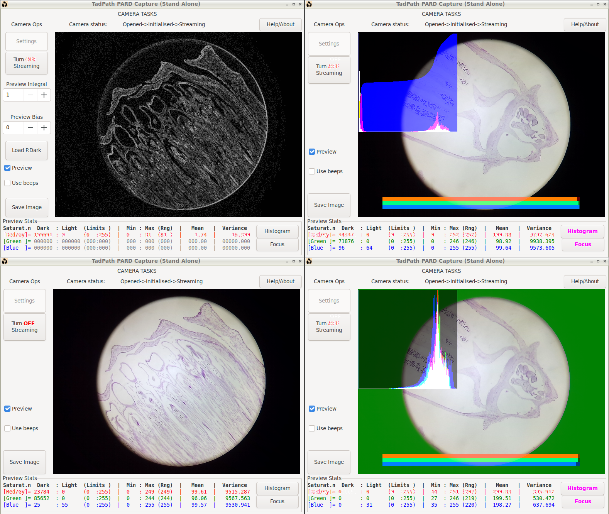
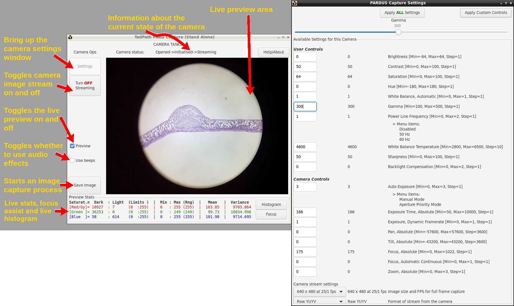
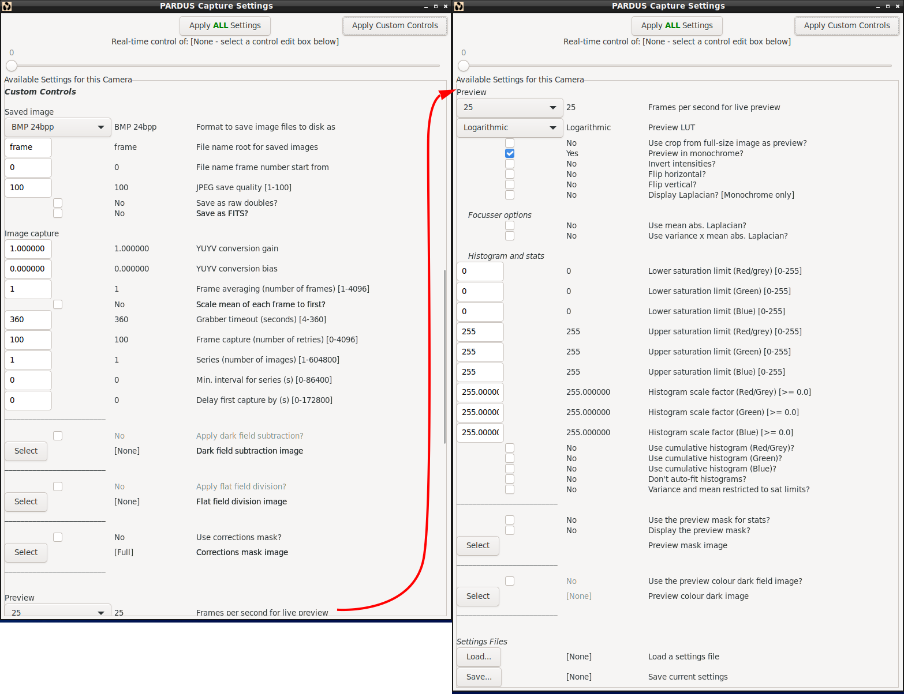

# PARD Capture
Scientific image acquisition software for Linux, FLOSS GPL v3

---

# 🚨 PROJECT MIGRATED TO CODEBERG 🚨

**This project has moved away from GitHub. Please find the active repository, latest releases, and documentation at our new permanent home:**

👉 **[https://codeberg.org/TadPath/PARDUS](https://codeberg.org/TadPath/PARDUS)**

---

---

Funding
-------
This is a self-funded project. I do all the work in my own time. If you like this software and want to support me in developing it, I welcome your donation to my Optarc / PUMA Microscope donation site via PayPal:

Thank you.

PJT

First Written: 12.11.2022

Last Edit: 27.11.2024
