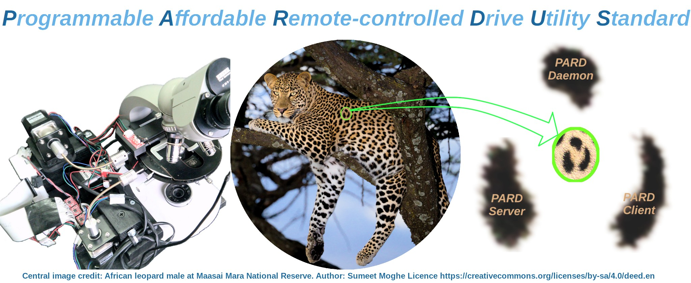

# PARDUS
Remote (network) control robotics and vision automation standard

---

----------------------- ------------------------------------
> :warning: **NOTE**: **The PARDUS project is NOT accepting pull requests at this stage of development. Any pull requests will be either blocked, ignored and/or deleted. I welcome bug reports, feature requests and issues / queries.**
----------------------------------------------------------------
This project is released under the following licenses:

For source code (including CAD files) and compiled code: the GNU GENERAL PUBLIC LICENSE Version 3
 
For documentation: the GNU Free Documentation License, Version 1.3

---
PARDUS was published in abstract form in the Journal of Pathology, 2020. Citation is: Tadrous, P. J. (2020, March). Pardus: An Affordable Open Source Hardware and Software Robotic Platform for Standard Microscopes. In JOURNAL OF PATHOLOGY (Vol. 250, pp. 15-15). 111 RIVER ST, HOBOKEN 07030-5774, NJ USA: WILEY.

You can get **free open access** to the article through the following links:
 
 * [Plain text abstract](docs/PARD_Abstract.md)
 
 * [Full PDF poster](docs/PARD_Poster.pdf)
 
 * [PDF of all abstracts for the meeting](https://www.pathsoc.org/_userfiles/pages/files/meetings/archive/WM2020AbsFile.pdf)
 
---
                       
Introduction
------------
The [P]rogrammable, [A]ffordable, [R]emote-controlled [D]rive [U]tility [S]tandard is an open source hardware and software combination I developed for general control of motorised robotic equipment with camera feedback control (as well as limit switches - both real and virtual). I developed the original working system back in mid 2019 using a motorised microscope as the example use-case (see poster PDF link above) but it is designed for general robotics and vision control over a network.

This software part of the standard is composed of three cooperating and communicating programs:

1. The **PARD Server**: This computer runs a frame grabber connected to a video device and controls multiple stepper motors with inputs from limit switches. It receives instructions from the user as to how to move the motors and when and how to acquire images from the camera and where to send those images. The user can give many instructions via a GUI running on the server but teh real power comes from the fact that the user can instead log in remotely and give instructions from a remote computer over the internet or intranet using the client program discussed below.
2. The **PARD Client** program runs on a remote computer (multiple OS are supported including MS Windows). The client may also be run on server machine. Via the PARD client the user can give instructions to the remote motor/camera system either as single manual commands or through a script for automatic execution of a series of commands such as whole slide XY scanning or Z scanning (or both) and many other procedures that may involve image capture at each stage. The images captured are sent via the network to be saved and / or processed on the client computer.
3. The **PARD Daemon**. What has been described so far with the client/server system is the ability to remotely move a series of motors and automatically acquire images which is fine if all you want to do is acquire image datasets with a robot (for example to create a whole slide image for archiving or 3D deconvolution or digital pathology using a robotic microscope). So far, that has all been done before with previous systems. However, the PARDUS system goes one step further and allows you to perform custom image processes on acquired images *on the client side* via a third program called the PARD Daemon which runs in the background on the client computer to execute custom commands. These commands may use *completely different software* to the PARDUS but the results are made available to the PARD Client. This allows information derived from the custom processing of captured images to be fed back into and guide the progress of the remote image and robotic procedures *on the server* according to some custom algorithm designed by the user. This also divides processing labour with image processing taking place on the client while robotic and image capture functions take place on the server with the results of image processing being fed back to guiide the actions of the robot on the server as part of a single custom automation algorithm. 

State of Development
--------------------
A full working demo system was built and tested mid 2019 using a Raspberry Pi as server connected to 3 Nema 17 motors and limit switches with a custom PCB and also to a USB camera. These were fitted to a Zeiss Standard microscope (shown in the above title picture) to effect automated slide scanning for AAFB detection (detection of tuberculosis bacilli in biopsies) using an MS Windows-based remote client. My [Pathological Society Poster PDF](docs/PARD_Poster.pdf) will give you more details of the system and some results.

Unfortunately the COVID Pandemic got in the way of me preparing the code for release back then and after that I was in the middle of making the [PUMA Microscope](https://github.com/TadPath/PUMA) system which took precedence. Only now have I returned to the PARDUS system because it fits in well with the stage of development of the PUMA project - being ready to explore image acquisition and more advanced techniques. So I have begun the long job of putting the PARDUS code into a state that would allow useful publication.

I have decided to re-work the PARDUS standard to make the PARD Server run on any Linux computer (with suffient resources) so that it is no longer restricted to a Raspberry Pi. This is because, although the RPi system worked well for the low powered applications I was doing for the demo system in 2019, it is not very scaleable and limits the potential of the project. Likewise I want to avoid reliance on a custom PCB in favour of already existing open source interface hardware. Therefore both the source code and the hardware standard defined in the original PARDUS need extensive revision and I will do what I can but **this project is unfunded and done in my own time** so progress may be quite slow as I have many other commitments.

For now I have extracted the basic image acquisition aspects of the PARD Server and put them into a fully functioning 'Stand Alone' program called **PARD Capture** which is available here in this repository. This has some extended features that were not available in the original PARD Server but it also lacks others (there is no server loop, no motor/limit switch control interface and no PARDUS Command Script (PCS) interpreter). However, it's a start. PARD Capture is a Linux-based image capture program for microscopy, astronomy and other scientific imaging applications. See the ReadMe.md file in the PARD_Capture folder of this repository for more details.

PJT

First Written: 11.11.2022

Last Edit: 12.11.2022
