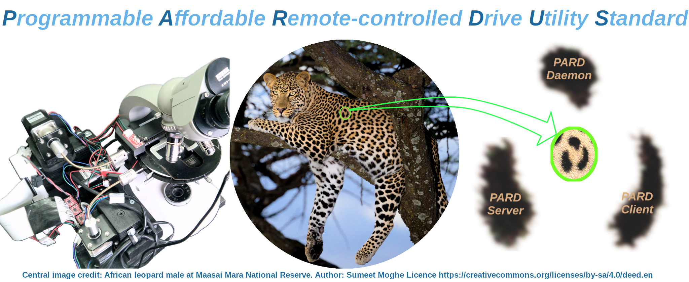

# PARDUS
Remote (network) control robotics and vision automation standard

---

----------------------- ------------------------------------
> :warning: **NOTE**: **The PARDUS project is NOT accepting pull requests at this stage of development. Any pull requests will be either blocked, ignored and/or deleted. I welcome bug reports, feature reqeusts and issues / queries.**
----------------------------------------------------------------

---

This project is released under the following licenses:

 For source code (including CAD files, STL files and computer programs) and compiled code: the GNU GENERAL PUBLIC LICENSE Version 3
 
 For documentation: the GNU Free Documentation License, Version 1.3

 PARDUS was published in abstract form in the Journal of Pathology, 2020. Citation is: Tadrous, P. J. (2020, March). Pardus: An Affordable Open Source Hardware and Software Robotic Platform for Standard Microscopes. In JOURNAL OF PATHOLOGY (Vol. 250, pp. 15-15). 111 RIVER ST, HOBOKEN 07030-5774, NJ USA: WILEY.

 You can get free open access to the article through the following links:
 > [Plain text abstract](docs/PARD_Abstract.txt)
 > [Full PDF poster](docs/PARD_Poster.pdf)
 > [PDF of all abstracts for the meeting](https://www.pathsoc.org/_userfiles/pages/files/meetings/archive/WM2020AbsFile.pdf)

---
                       
Introduction
------------
The [P]rogrammable, [A]ffordable, [R]emote-controlled [D]rive [U]tility [S]tandard is an open source hardware and software combination I developed for general control of motorised robotic equipment with camera feedback control (as well as limit switches - both real and virtual). I developed the original working system back in mid 2019 using a motorised microscope as the example use-case (see poster PDF link above) but it is designed for general robotics and vision control over a network.
This software part of the standard is composed of three cooperating and communicating programs:
1. The Pardus Main Program and Server: This runs on the Raspberry Pi (using Raspbian and the Pigpio daemon) connected to the motors (via a separate driver board) and camera and it receives instructions from the user as to how to move the motors and when and how to acquire images from the camera and where to send them. The user can give many instructions via the Main Program GUI but can also give instructions from a remote computer using the client program discussed below.
2. The Pardus Client Program runs on a remote computer (multiple OS are supported including MS Windows). The client may also be run on the same Raspberry Pi as the main program simultaneously but this is not recommended because it puts a lot of strain on the Pi. Via the client program the user can give instructions to the remote motor/camera system either as single manual commands or through a script for automatic execution of a series of commands such as whole slide XY scanning or Z scanning (or both) and many other procedures that may involve image capture at each stage. The images captured are sent via the network to be saved on the client computer.
3. The Pardus Daemon. What has been described so far with client/server is the ability to remotely move a stage and automatically acquire images which is fine if all you want to do is acquire image datasets such as create a whole slide image for archiving or 3D deconvolution or digital pathology. However, the Pardus system goes one step further and allows you to perform custom image processes on the images acquired during acquisition via a third program called the Pardus Daemon which runs in the background on the client computer an communicates with the client program to execute custom commands via the host OS command processor. 

PJT

First Written: 11.11.2022

Last Edit: 11.11.2022
