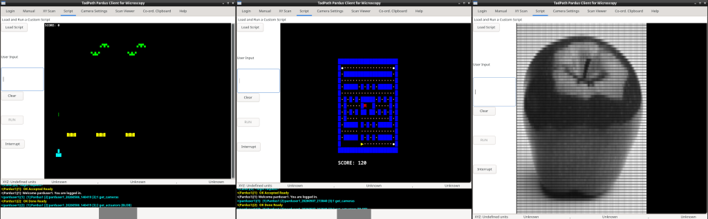

# Example PCS Programs

This directory contains sample programs written in the PCS programming language to help both human and AI coders learn its use.
All the programs here have been checked and run successfully without errors.

* Scripts beginning with 'ai_' were written by an AI coding agent.
* Scripts beginning with 'hu_' were written by an human coder.

**Warning**: A sample PCS header file is also included here but be warned that the pin mappings, direction values and any other hardware-specific settings are based on my own CNC stage and Arduino, motor and limit switch wiring so you should not use this header file directly in any scripts you run without first checking, and editing where required, all those hardware-specific settings to match your hardware connections. Serious damamge to your hardware may result if you do not follow this advice.

# Notes on the programs and other files here

## ai_arraytest.pcs
This demonstrates the use of arrays including auto-casting and the ability for recursive dereferencing.

## ai_bubblesort.pcs
A classical bubble sort algorithm implemented in PCS to demonstrate recursion and the Turing complete nature of PCS.

## ai_img_viewer.pcs
A program to read (from disk) and display pgm P2 and ppm p3 images with PCS. Demonstrates getting interactive user input to get the file name from the user as well as file input and display of greyscale and colour pixels to the script console. This can't parse comments in the files so if you make an image with a program that places comments in the header (like the gimp) then be sure to remove the comment lines before attempting to load the image). Two example images are provided here for testing: preview.ppm and preview.pgm

## ai_img_viewer_v2.pcs
This is a more advanced version of the ai_img_viewer program in that it shows how to use byte-precise file reading to enable the reading of p5 and p6 binary PNM images as well as p2 and p3 ASCII images  (illustrated at top right). It also uses advaned character management so that it can detect and skip comments in the PNM headers. This program will read the p2 and p3 example images provided for testing the simpler image viewer: preview.ppm and preview.pgm. In addition, it will read the two binary PNM images provided here: preview_p5.pgm and preview_p6.ppm which also contain comments in the headers.

## ai_interp_marauders.pcs
A fully playable video game that illustrates the general programming abilities of PCS (illustrated at top left). This includes interactive real time user input from the keyboard, animated UTF-8 colour graphics on the script console window, the use of PCS to make a pseudorandom number generator with its general maths commands, and the ability to read a custom image as a front splash screen.
This is more of an AI - human collaboration than a fully AI generated program. I started the AI off by writing a simple 'turret commander program' that allows the user to move the turrent left and right and fire missiles. The AI then took hat code and added various features under my supervision to build the complete game. The AI wrote a dedicated readme guid to the game which you can find here labelled 'ReadMe_IPM.md'.
The front splash looks for an image on disc called splash.bin (provided here as well). If it finds it then it will render that image as the splash screen. Otherwise it will render a generic star field splash graphic.

## ai_jump_table.pcs
This demonstrates the how the non-local, stack-aware goto command can jump out of nested code using string a array variable as the label identifier.

## ai_the_kibble_cat.pcs
I tried to get the AI to make a game from scratch but it wasn't all that good. Still this one is playable - move the cat around the maze and eat all the kibbles to win.

## ai_pacmunch.pcs
I gave AI the full listing for 'interplanetary marauders' and asked it to program a 'pac-man' style game and this is what it came up with (illustrated top middle) - after some to-and-fro with me. It is a fully playable game with ghost logic, 'power pellets' that enable the character to turn tables on the ghost, etc. It's not bad for an AI effort - especially considering this is a 'new' language and all it had to go on was the example PCS script I gave it and the llms.txt file in this repository plus a few manual entries I posted on its interface for some commands. This was done with the free Google 'AI Mode' search engine Gemini 3 model - not some AI coding specialist program.

## hu_bubblesort.pcs
This is the AI bubble sort program that i edited to use the language more efficiently.

## hu_hello_world.pcs
Minimal working program in PCS - prints the string "Hello World!" to the script console. This demonstrates that you do not need to have any formal functions defined in PCS.

## hu_interactive_motion_af.pcs
This is a script I use on the PUMA CNC stage to allow interactive motion of the stage and autofocus triggering. An example of a practical microscopy script.

## hu_milliseconds.ps
A script that demonstrated the use of the Millis system variable and milliduration command for time keeping.

## hu_MIM_Test.pcs
An example practical microscopy script for measuring minimum incremental motion (MIM) of the PUMA CNC stage.

## hu_unicode_dashboard_1.pcs
Demonstrates how to build simple graphical feedback controls in the scripe console.

## ppinclude.pch
An example of a practical PCS header file. This is required for my microscopy scripts here.

## preview.pgm, preview_p5.pgm, preview.ppm and preview_p6.ppm
These are test PNM iamges for use with ai_img_viewer.pcs (will only read the p2 and p3 images) and ai_img_viewer_v2.pcs (will read all of them)

## ReadMe_IPM.md
A markdown manual for the interplanetary marauders game, written by an AI.

## splash.bin
A binary file containing the splash image for the interplanetary marauders game. For this to work it has to be placed in the directory where the pardclient interpreter program was run from.

PJT 04.05.2026
